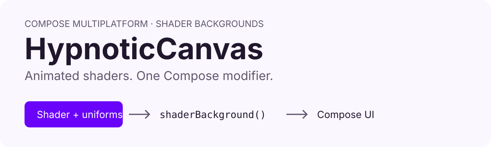
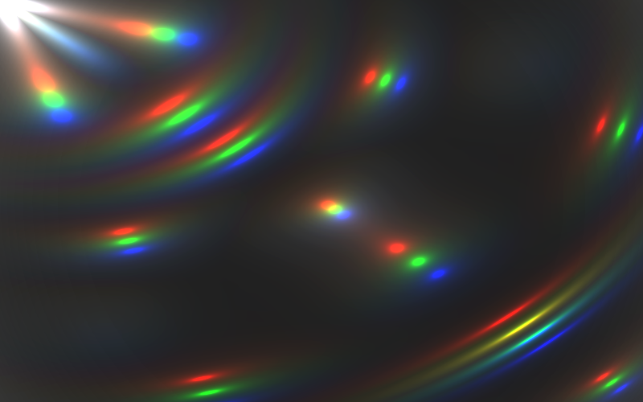
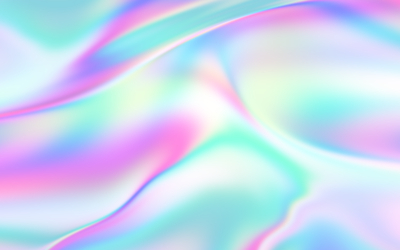

<h1 align="center">HypnoticCanvas</h1>

<p align="center">Animated shader backgrounds for Compose Multiplatform.</p>

<p align="center">
  <a href="https://github.com/mikepenz/HypnoticCanvas/actions/workflows/ci.yml"></a>
  <a href="https://central.sonatype.com/artifact/com.mikepenz.hypnoticcanvas/hypnoticcanvas"></a>
  <a href="https://scorecard.dev/viewer/?uri=github.com/mikepenz/HypnoticCanvas"></a>
  <a href="LICENSE"></a>
</p>

<p align="center">
  <picture>
    <source media="(prefers-color-scheme: dark)" srcset="art/hero-dark.svg">
    
  </picture>
</p>

<p align="center">
  <a href="#quickstart">Quickstart</a> &bull;
  <a href="#showcase">Showcase</a> &bull;
  <a href="#reference">Reference</a> &bull;
  <a href="https://mikepenz.github.io/HypnoticCanvas/">Live demo</a> &bull;
  <a href="SECURITY.md">Security</a>
</p>

| Capability | What you get |
| --- | --- |
| Compose modifier | Apply a shader behind your existing UI with `Modifier.shaderBackground`. |
| Configurable animation | Set animation `speed`; configure `MeshGradient` colors and scale. |
| Android fallback | Supply a `Brush` on Android below API 33. The default fallback is transparent. |
| Multiplatform | Android, Desktop JVM, iOS, and Wasm sample apps. |
| Separate shader modules | Three MIT core shaders; additional shaders have separate license terms. |

## Quickstart

1. Add the core dependency to `commonMain`. Use the version shown by the Maven Central badge:

```kotlin
commonMain.dependencies {
    implementation("com.mikepenz.hypnoticcanvas:hypnoticcanvas:<version>")
}
```

2. Apply a shader inside a composable:

```kotlin
import androidx.compose.foundation.layout.Box
import androidx.compose.foundation.layout.fillMaxSize
import androidx.compose.ui.Modifier
import com.mikepenz.hypnoticcanvas.shaderBackground
import com.mikepenz.hypnoticcanvas.shaders.GlossyGradients

Box(Modifier.fillMaxSize().shaderBackground(GlossyGradients))
```

3. Set the animation speed and a fallback for older Android devices:

```kotlin
import androidx.compose.ui.graphics.Brush
import androidx.compose.ui.graphics.Color

Box(
    Modifier.fillMaxSize().shaderBackground(
        shader = GlossyGradients,
        speed = 0.5f,
        fallback = { Brush.horizontalGradient(listOf(Color.Magenta, Color.Blue)) },
    )
)
```

> [!IMPORTANT]
> The optional `hypnoticcanvas-shaders` module includes noncommercial shaders.
> Read the [shader credits](#shaders-shaders-module) and [license terms](#shaders-module-license) before using it.

## Showcase

These are fixed-time renders of the actual core shaders using the same Skia runtime
and Compose brush wrapper as the Desktop sample. They show shader output, without sample UI overlays.
The `MeshGradient` panel uses the sample app's colors and `scale = 1f`.
Source: [ReadmeArtTest.kt](hypnoticcanvas-shaders/src/jvmTest/kotlin/com/mikepenz/hypnoticcanvas/shaders/ReadmeArtTest.kt).

<p align="center">
  
  
  
</p>

<p align="center"><sub>MeshGradient &bull; MesmerizingLens &bull; GlossyGradients. All three core shaders are MIT licensed.</sub></p>

[Try the animated sample](https://mikepenz.github.io/HypnoticCanvas/).

Refresh images deliberately, then verify them:

```bash
./gradlew :hypnoticcanvas-shaders:recordReadmeArt -PrecordReadmeArt=true --rerun-tasks
./gradlew :hypnoticcanvas-shaders:verifyReadmeArt
```

The original recorded demo is also available:

https://github.com/mikepenz/HypnoticCanvas/assets/1476232/ee120f1c-d18a-43c4-a7bc-a2d245e01482

---

# Reference

| Topic | Link |
| --- | --- |
| Dependencies | [Setup](#setup) |
| Shader configuration | [Usage](#usage) |
| Platform requirements | [Compatibility](#compatibility) |
| Sample commands | [Build and run](#build--run-sample-app) |
| Authors and shader licenses | [Credit](#credit) |
| License terms | [License](#license) |
| Vulnerability reporting | [Security policy](SECURITY.md) |

## Setup

### Core-module

```gradle
implementation "com.mikepenz.hypnoticcanvas:hypnoticcanvas:${version}"
```

> [!NOTE]  
> All shaders provided in the `core` module are licensed either under `MIT` or `Apache 2.0` license.

### Shader-module

```gradle
implementation "com.mikepenz.hypnoticcanvas:hypnoticcanvas-shaders:${version}"
```

> [!IMPORTANT]  
> Shaders in this module have non permissive licenses. Ensure to read the
> [LICENSE](https://github.com/mikepenz/HypnoticCanvas?tab=readme-ov-file#shaders-module-license)
> section of the README.

## Usage

```kotlin
Box(
    modifier = Modifier
        .fillMaxSize()
        .shaderBackground(BlackCherryCosmos)
)

// Usage of Shader with configurations
Box(
    modifier = Modifier
        .fillMaxSize()
        .shaderBackground(
            MeshGradient(
                arrayOf(Color(0xFFFF15E5), Color(0xFFFAAEF7), Color(0xFF6903F9)),
                scale = 1f
            )
        )
)
```

## Compatibility

This checkout uses Kotlin 2.4.10 and Compose Multiplatform 1.12.0. Android requires
API 23 or newer, with shaders available on API 33 or newer and the fallback brush
used below API 33. iOS requires version 14 or newer. Building requires JDK 21.

HypnoticCanvas is built
with [Compose Multiplatform](https://www.jetbrains.com/lp/compose-multiplatform/), meaning that it
supports different platforms:

| Platform      | Supported | Link                                                 |
|---------------|-----------|------------------------------------------------------|
| Android       | ✅  (A13+) |                                                      |
| Desktop (JVM) | ✅         |                                                      |
| iOS           | ✅         |                                                      |
| Wasm          | ✅         | [Sample](https://mikepenz.github.io/HypnoticCanvas/) |

## Build & Run Sample App

### Build Android App

```bash
./gradlew sample-android:assembleDebug
```

### Run Desktop App

```bash
./gradlew sample:run
```

### Run Web App

```bash
./gradlew sample:wasmJsBrowserDevelopmentRun
```

### Update aboutLibraries.json

```bash
 ./gradlew sample:exportLibraryDefinitions
 ```

## Credit

The base project setup is strongly based on the [haze](https://github.com/chrisbanes/haze) project
by [Chris Banes](https://github.com/chrisbanes/),
Licensed under [Apache License 2.0](https://github.com/chrisbanes/haze/blob/main/LICENSE)

The individual shaders are based on the respective shaders licenses. More details below.

### Shaders core-module

| Name                                                     | Author                                                          | License     | Note                                                                         |
|----------------------------------------------------------|-----------------------------------------------------------------|-------------|------------------------------------------------------------------------------|
| MeshGradient                                             | Mike Penz                                                       | MIT License |                                                                              |
| MesmerizingLens                                          | Mike Penz                                                       | MIT License |                                                                              |
| [GlossyGradients](https://www.shadertoy.com/view/lX2GDR) | [Giorgi Azmaipharashvili](https://www.shadertoy.com/user/Peace) | MIT License | Rights bought for this shader on Fiverr, included in this project under MIT. |

### Shaders shaders-module

| Name                                                                                                                                                                                      | Author                                              | License              | Note                                                                                              |
|-------------------------------------------------------------------------------------------------------------------------------------------------------------------------------------------|-----------------------------------------------------|----------------------|---------------------------------------------------------------------------------------------------|
| [BlackCherryCosmos2](https://editor.isf.video/shaders/612cb473f4fe08001a0a6281) [via](https://glslsandbox.com/e#28545.0) [via](https://editor.isf.video/shaders/5e7a7fcf7c113618206de4cc) | [axiomcrux](https://editor.isf.video/u/axiomcrux)   | CC BY-NC-SA 3.0 DEED | Shader does not specifically include license, however found the shader it appears to be based on. |
| [GoldenMagma](https://www.shadertoy.com/view/tdBBRV)                                                                                                                                      | [TAKUSAKU](https://www.shadertoy.com/user/TAKUSAKU) | CC BY-NC-SA 3.0 DEED |                                                                                                   |
| [IceReflection](https://www.shadertoy.com/view/3djfzy)                                                                                                                                    | [TAKUSAKU](https://www.shadertoy.com/user/TAKUSAKU) | CC BY-NC-SA 3.0 DEED |                                                                                                   |
| [InkFlow](https://www.shadertoy.com/view/WdjBWD)                                                                                                                                          | [TAKUSAKU](https://www.shadertoy.com/user/TAKUSAKU) | CC BY-NC-SA 3.0 DEED |                                                                                                   |
| [OilFlow](https://www.shadertoy.com/view/Wd2fDW)                                                                                                                                          | [TAKUSAKU](https://www.shadertoy.com/user/TAKUSAKU) | CC BY-NC-SA 3.0 DEED |                                                                                                   |
| [PurpleLiquid](https://www.shadertoy.com/view/dsXyzf)                                                                                                                                     | [fouad](https://www.shadertoy.com/user/fouad)       | CC BY-NC-SA 3.0 DEED |                                                                                                   |
| [RainbowWater](https://www.shadertoy.com/view/dtySRR)                                                                                                                                     | [flylo](https://www.shadertoy.com/user/flylo)       | CC BY-NC-SA 3.0 DEED |                                                                                                   |
| [Stage](https://www.shadertoy.com/view/wtfcDj)                                                                                                                                            | [TAKUSAKU](https://www.shadertoy.com/user/TAKUSAKU) | CC BY-NC-SA 3.0 DEED |                                                                                                   |

## License

The core project code in this repository is licensed as under Apache
2.0. `SPDX-License-Identifier: Apache-2.0`.

All Shaders are provided under their respective Authors license.

Shaders in the `hypnoticcanvas` module are licensed either as `MIT, or Apache 2.0`.
Shaders in the `hypnoticcanvas-shaders` module are licensed
as `SPDX-License-Identifier: CC-BY-NC-SA-3.0`.

### Core module License

The source code for the core module is licensed under Apache 2.0, with the shaders provided in the
core module as MIT License.

```
Copyright 2024-2026 Mike Penz
 
Licensed under the Apache License, Version 2.0 (the "License");
you may not use this file except in compliance with the License.
You may obtain a copy of the License at

    https://www.apache.org/licenses/LICENSE-2.0

Unless required by applicable law or agreed to in writing, software
distributed under the License is distributed on an "AS IS" BASIS,
WITHOUT WARRANTIES OR CONDITIONS OF ANY KIND, either express or implied.
See the License for the specific language governing permissions and
limitations under the License.
```

### Shaders module License

Shaders in this module are most from [ShaderToy.com](https://www.shadertoy.com/) and are
licensed [Attribution-NonCommercial-ShareAlike 3.0 Unported](https://creativecommons.org/licenses/by-nc-sa/3.0/).
Which is the default license as outlined by [ShaderToy.com](https://www.shadertoy.com/terms)
